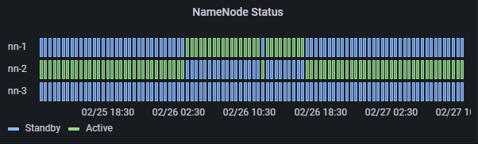

<h1 align="center">FastAutoFailover</h1>

## About

Installation and configuration Fast Auto Failover (High Availability) using the HDFS Quorum Journal Manager when running two or more redundant NameNodes in the same cluster.
In that mode, the system will automatically trigger a failover from the active to the standby NameNode if the active node has failed.

## Before you begin
In order to deploy an Fast Auto Failover HA cluster, you should prepare the following:
- **NameNode machines** - the machines on which you run the Active and Standby NameNodes should have equivalent hardware to each other, and equivalent hardware to what would be used in a non-HA cluster.

- **JournalNode machines** - the machines on which you run the JournalNodes. The JournalNode daemon is relatively lightweight, so these daemons may reasonably be collocated on machines with other Hadoop daemons, for example NameNodes, the JobTracker, or the YARN ResourceManager. Note: There must be at least 3 JournalNode daemons, since edit log modifications must be written to a majority of JNs. This will allow the system to tolerate the failure of a single machine. You may also run more than 3 JournalNodes, but in order to actually increase the number of failures the system can tolerate, you should run an odd number of JNs, (i.e. 3, 5, 7, etc.). Note that when running with N JournalNodes, the system can tolerate at most (N - 1) / 2 failures and continue to function normally.

Note that, in an HA cluster, the Standby NameNodes also performs checkpoints of the namespace state, and thus it is not necessary to run a Secondary NameNode, CheckpointNode, or BackupNode in an HA cluster. In fact, to do so would be an error. This also allows one who is reconfiguring a non-HA-enabled HDFS cluster to be HA-enabled to reuse the hardware which they had previously dedicated to the Secondary NameNode.

## How to Run
-> FastAutoFailover (main): Run setupHA.yml

## Verifying automatic failover
Once automatic failover has been set up, you can test its operation. To do so, first locate the active NameNode. You can tell which node is active by visiting the NameNode web interfaces – each node reports its HA state at the top of the page.

Once you have located your active NameNode, you may cause a failure on that node. For example, you can use kill -9 <pid of NN> to simulate a JVM crash. Or, you could power cycle the machine or unplug its network interface to simulate a different kind of outage. After triggering the outage you wish to test, the other NameNode should automatically become active within several seconds. The amount of time required to detect a failure and trigger a fail-over depends on the configuration of ha.zookeeper.session-timeout.ms, but defaults to 5 seconds.

  

## Copyright and license
- [Copyright](https://github.com/cloudx-group/cxhadoop/blob/dev_budnevgv/cloudx/prometheus_exporter/COPYRIGHT)
- Code released under the [Company](https://www.cloudx.group/)